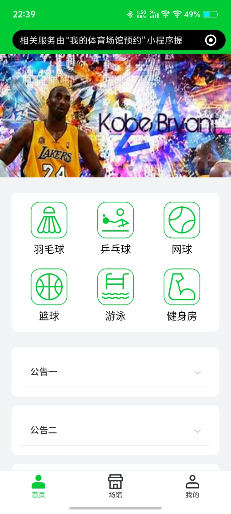
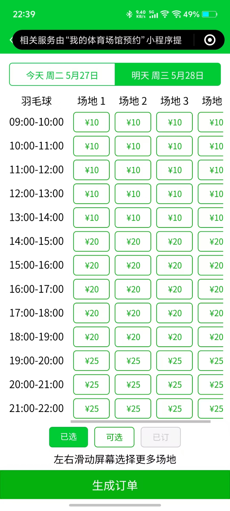
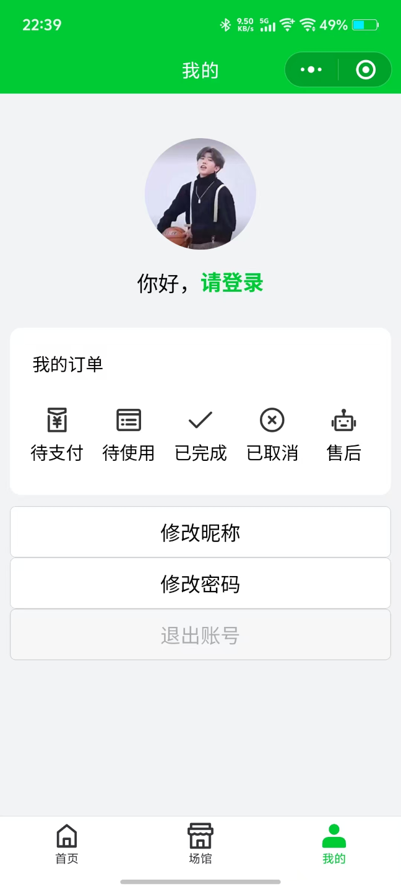

<h2 align=center>体育馆预约微信小程序服务端代码</h2>

1、技术栈：go、MySQL、Redis、RabbitMQ

2、使用的Go框架：gin、gorm、go-redis、amqp091-go

3、容器部署：通过docker-compose，可以一键将go程序、MySQL、Redis、RabbitMQ直接部署到docker运行。

<h3 align=center>小程序展示</h4>

